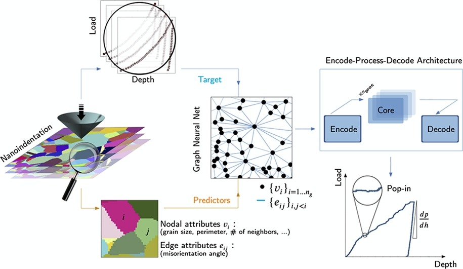

# Prediction of Steel Nanohardness using Graph Neural Networks

This repository contains code and resources for predicting nanoscale hardness in polycrystalline metals using Graph Neural Networks (GNNs). The methods and models presented here are based on the research paper titled **"Prediction of steel nanohardness by using graph neural networks on surface polycrystallinity maps"**, published in *Scripta Materialia* ([Karimi et al. Scripta Materialia, 234:115559, 2023](https://doi.org/10.1016/j.scriptamat.2023.115559)).



## Overview

Nanoscale hardness in polycrystalline steels is influenced by microstructural features such as grain orientations and neighboring grain properties. This project uses GNNs to predict nanohardness from electron backscatter diffraction (EBSD) maps of 310S steel surfaces, focusing on grain-scale load-displacement curves.

## Key Features

- **Graph Neural Network Model:** Trained on grain centers as graph nodes to predict nanohardness based on microstructural descriptors.
- **Microstructural Descriptors:** Includes grain size, shape factors, and neighboring grain properties.
- **Nanoindentation Data:** Load-displacement curves used for training the model.

## Requirements

- Python 3.x
- TensorFlow
- DeepMind’s GNN library
- Other Python packages (see `gnnPolyCryst.ipynb`)

## Installation

1. Clone this repository:
    ```bash
    git clone git@github.com:kkarimi62/polyGNN.git
    cd polyGNN
    ```

## Usage

1. **Prepare Data:**
   - Ensure you have EBSD maps and nanoindentation data in the correct format.
   - Place your data files in the `data/` directory.

2. **Train the Model:**
   - Execute Jupyter notebook `gnnPolyCryst.ipynb`
